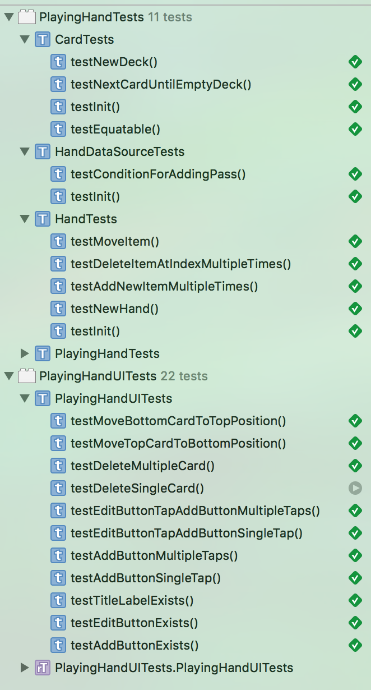

####Master branch build status: 

Playing Hand
===============

Background
----------
Working example of Daniel Stienberg's talk on Swift architecture combining functional, object-oriented, protocol-oriented programming.

Demo
----

Test results
------------
<h3 align="left">

</h3>